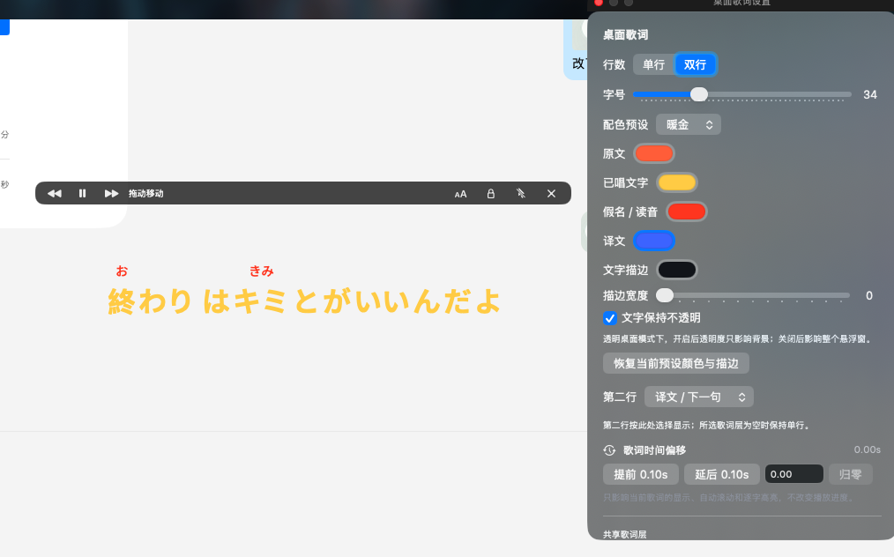
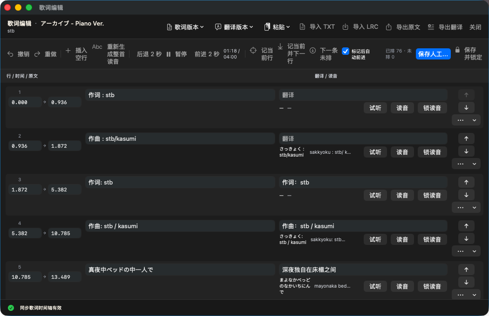

# lyricsQ

### 跟着 Spotify 听歌，也认真看歌词。

一款面向 macOS Spotify Desktop 的原生歌词应用，提供沉浸式主播放页、桌面歌词、歌词版本管理与手动时间轴编辑。

> **开发中的预发布测试版，不是正式发布版。**
> 功能仍在迭代，截图不代表全部功能通过验收。**AI、自动排轴、顶部胶囊目前有 Bug，不可用**；请先阅读下方限制。

[下载测试版](https://github.com/suifracti/lyricsQ/releases/tag/v0.1.2-preview.1) · [功能状态](docs/STATUS.md) · [全部截图](docs/work/experience-restoration/experience-feedback-report.md)


## 可以用它做什么

以下是当前提供的功能与入口，不是“全部稳定可用”的保证；具体限制见下一节。

| 功能 | 内容 |
| --- | --- |
| Spotify 播放同步与控制 | 读取当前歌曲、歌手、专辑、封面和进度；播放/暂停、上下曲及拖动进度会控制 Spotify |
| 沉浸式主播放页 V3 | 环境光、经典、舞台三种构图；封面尺寸、背景扩散、歌词对齐；横竖窗口与原生全屏适配 |
| 悬停显示播放信息 | 环境光/经典按封面区域显示控件，隐藏时适度放大封面；舞台按播放器上下半区显示/隐藏控件 |
| 歌词与读音 | 原文、翻译、假名、罗马音、拼音图层；假名支持汉字上方注音、独立行和替换排版；真实逐字时间数据可驱动逐字高亮 |
| 歌词时间 | 主播放页直接点击“歌词时间”提前、延后或归零；与桌面歌词共用“当前歌曲＋当前歌词版本”的偏移，不修改原始时间戳或 Spotify 进度 |
| 搜索与版本选择 | 多来源候选、来源标识、保存与切换；歌词、翻译、读音和时间轴版本管理 |
| 复制 | 右键复制歌名、歌手、单行歌词、整首歌词或选定段落 |
| 桌面歌词 | 单行/双行、第二行内容选择、字号、独立角色颜色、透明度与描边；锁定/鼠标穿透及恢复交互入口 |
| 全屏与菜单栏 | 全屏歌词、按样式保存对齐和阅读尺寸；菜单栏歌曲信息与基础播放控制（不是下方标为不可用的顶部胶囊） |
| 手动歌词编辑 | 原文、翻译、读音、逐行时间与行顺序编辑；插入、拆分/合并、撤销/重做；保存修订版本 |
| 导入与导出 | TXT/LRC、剪贴板内容、原文/翻译导出；个人歌词资产包导入导出 |
| 本地歌词库 | 管理采用版本、版本名称与备注；可指定同步文件夹（不是内置云服务） |
| 日语辅助 | 本地读音生成与歌曲级手动纠音；姓名、多音字和罕见词可能需要校对 |
| 最近播放与统计 | 应用运行时观察到的播放记录、时长、趋势及歌曲/歌手排行；不是 Spotify 的完整历史 |

## 已知 Bug 与限制

**以下功能目前不可用，不应当作测试版的可用能力：**

- **AI 翻译、重新翻译及 AI 辅助歌词处理：Bug / 当前不可用。**
- **自动排轴、音频强制对齐：Bug / 当前不可用。** 请使用手动歌词时间编辑。
- **顶部胶囊／灵动岛式歌词：Bug / 当前不可用。** 界面中仍可能存在入口。

其它实验 UI 和调试工具也不属于正式交付能力；不因为存在入口就代表已完成。主播放页、桌面歌词等仍接受实机反馈，不保证所有歌曲、尺寸和系统环境表现一致。

### 歌词匹配不是百分之百准确

- 在线来源包括 AMLL、LRCLIB、lyrics.ovh，以及实验性的酷我、酷狗、网易云、QQ 音乐；可用性和返回质量依赖第三方。lyrics.ovh 是纯文本候选，不提供同步时间轴。
- **Piano Ver.、Live、Remix 等可能匹配到普通版或近似录音。** 切换前请核对标题、时长、来源并试听；不会因为展示了版本名称就保证录音匹配。
- 统一“提前/延后”适合整首固定偏差；逐行误差或不同编曲无法靠一个 offset 修复，应选择更匹配的候选，或在编辑器保存新的修订版本。
- 逐字高亮依赖真实逐字时间数据；只有逐行时间的歌词不等同于真实逐字同步。翻译与读音也取决于该版本具备的图层。
- 最近播放和统计只覆盖应用观察到的播放；旧记录或未运行期间的历史不会被补全。

## 更多画面

截图里反复出现 **stb《アーカイブ - Piano Ver.》**，只是因为作者当时一直在单曲循环它。不是应用只支持这一首，也不是故意用一首歌代表所有歌曲的同步质量。

### 舞台与经典布局


### 桌面歌词与手动编辑





[查看全部 16 张截图：外观设置、复制、歌词库、最近播放与听歌统计 →](docs/work/experience-restoration/experience-feedback-report.md)

## 下载与安装

- **测试包：v0.1.2-preview.1，应用版本 0.1.2（build 3）。不是正式版。**
- 本次 DMG 面向 **Apple Silicon（arm64）**，要求 **macOS 14 或更高版本**，配合 Spotify Desktop 使用；未提供 Intel 安装包。
- 从[预发布页面](https://github.com/suifracti/lyricsQ/releases/tag/v0.1.2-preview.1)下载 DMG，打开后将应用拖到 Applications。请自行保留旧版，重要歌词资产建议先导出。
- 包内应用使用本地 ad-hoc 签名，**没有 Developer ID 签名或 Apple 公证**。系统可能阻止打开；仅在确认来源并愿意承担测试风险时，使用系统“隐私与安全性”中的单次打开许可，不要关闭系统安全保护。
- 首次控制 Spotify 需要系统自动化授权。当前测试范围不要求为不可用的自动排轴功能授予录音或屏幕录制权限。
- Release 构建配置只是编译方式，**不代表这是正式发布版**。下载页附源码标识和 SHA-256 校验信息。

## 从源码构建

```sh
git clone https://github.com/suifracti/lyricsQ.git
cd lyricsQ
open SpotifyLyrics.xcodeproj
```

选择 SpotifyLyrics scheme。也可以构建 Debug：

```sh
xcodebuild -project SpotifyLyrics.xcodeproj \
  -scheme SpotifyLyrics \
  -configuration Debug \
  -derivedDataPath /tmp/lyricsq-deriveddata \
  CODE_SIGNING_ALLOWED=NO build
```

需要 macOS 与 Xcode。部分系统权限调试可能需要本机签名；不要提交个人证书、Team ID 或凭据。测试与提交规则见[开发流程](docs/DEVELOPMENT_WORKFLOW.md)和[提交检查](docs/SUBMISSION_BASELINE.md)。

## 数据与隐私

- 歌词、修订版本和收听记录默认保存在本机 Application Support 的 SpotifyLyrics 数据库中；偏好设置保存在本机。
- 授权令牌和配置的 API Key 使用 Keychain；不要将凭据、数据库或个人导出资产提交到仓库。
- 查询在线歌词会向对应来源发送匹配所需的歌曲信息。配置第三方 AI 服务的代码路径可能发送歌词文本；该功能当前不可用，不建议依赖。
- 文件夹同步使用你选择的位置；是否上传云端取决于该文件夹所用的同步服务。

## 版权与说明

本项目与 Spotify、Apple 及歌词来源服务无隶属或背书关系。音乐、歌词、封面和其它第三方图像归各自权利人所有；展示不代表授予再分发许可。

本仓库公开可见，但**不是开源授权项目**。原创源码、文档和设计保留全部权利；使用范围见 [LICENSE](LICENSE)。测试版下载不改变该许可边界。
