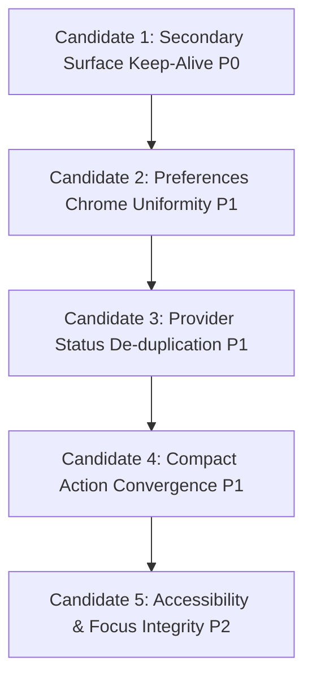

# V3 Main Window Top-Right Toolbar Convergence Implementation Plan

**Document Status**: Proposed Implementation Plan
**Branch**: `antigravity/v3-toolbar-design`
**Base Commit**: `7df89eb4dc0ba2d91404c18823db3bf6b037f907`
**Design Contract Reference**: `docs/superpowers/specs/2026-09-03-v3-main-toolbar-design.md` (`835a06de5c1b6fe52e2a86fa88f8d9b6da8869ce`)

---

## 1. Overview & Architectural Boundary

This implementation plan translates the approved V3 Main Toolbar Convergence Design Contract into a set of minimal, decoupled, and verifiable candidates.

### 1.1 Architectural Boundary
- The toolbar resides exclusively within the **Interactive Layer** of the V3 Main Window.
- Implementation is confined to [`AppleMusicImmersiveV3WindowView.swift`](file:///private/tmp/spotifylyrics-v3-toolbar-design/SpotifyLyrics/Views/MainWindow/AppleMusicImmersiveV3WindowView.swift).
- No modifications to Settings Center, Fullscreen, Floating lyrics, Top Capsule, Playback Transport, Background shaders/blur, Presentation Clock, or Lyrics provider pipelines.

---

## 2. Implementation Surface Map

| Component / State | Current Code Location | Role in Convergence |
| :--- | :--- | :--- |
| `isSearchPresented` | `AppleMusicImmersiveV3WindowView.swift:25` | Presentation state for Song Search popover. |
| `isVisualTuningPresented` | `AppleMusicImmersiveV3WindowView.swift:26` | Presentation state for V3 Visual Tuning popover. |
| `isCurrentSongOperationsPresented` | `AppleMusicImmersiveV3WindowView.swift:33` | Presentation state for Current Song Operations popover. |
| `toolsVisible` & keep-alive | `AppleMusicImmersiveV3WindowView.swift:65, 77-85` | Visibility gating and hover-sensor logic. |
| `toolBar` | `AppleMusicImmersiveV3WindowView.swift:614-637` | Root capsule container for toolbar buttons. |
| `windowModeMenu` | `AppleMusicImmersiveV3WindowView.swift:639-675` | Window projection mode selection menu. |
| `providerStatusMenu` | `AppleMusicImmersiveV3WindowView.swift:677-708` | Status indicator dot and recovery/status menu. |
| `searchButton` | `AppleMusicImmersiveV3WindowView.swift:800-813` | Manual song/lyrics search button. |
| `currentSongOperationsButton` | `AppleMusicImmersiveV3WindowView.swift:815-828` | Per-track lyrics operations popover trigger. |
| `layoutMenu` | `AppleMusicImmersiveV3WindowView.swift:830-844` | V3 presentation mode & visual tuning trigger. |
| `preferencesButton` | `AppleMusicImmersiveV3WindowView.swift:846-851` | Global macOS SettingsLink. |

---

## 3. Implementation Candidates & Priority

---

### Candidate 1 (P0) — Secondary Surface Keep-Alive

#### Problem
In `AppleMusicImmersiveV3WindowView.swift`, the visibility suppression logic only checks `isVisualTuningPresented`. When a user clicks `searchButton` or `currentSongOperationsButton` and moves the pointer down into the opened popover (leaving `location.y <= 96`), `toolsVisible` is immediately set to `false`, causing the toolbar to fade out beneath the active popover.

#### Primary Implementation Surface
- `AppleMusicImmersiveV3WindowView.swift`:
  - Lines 65–70: `.opacity(...)` and `.allowsHitTesting(...)` visibility predicates.
  - Lines 77–86: `onContinuousHover` event handling branch.

#### Allowed Changes
- Expand the presentation suppression check to incorporate all toolbar-associated popover states:
  - `isVisualTuningPresented`
  - `isSearchPresented`
  - `isCurrentSongOperationsPresented`
- Ensure that when all secondary surfaces close, the existing 3.0s idle auto-hide and 96pt hover reveal semantics resume cleanly.

#### Explicit No-Go
- Do not create a new state-machine or window-level coordinator.
- Do not introduce state wrappers for SwiftUI `Menu` controls that natively handle their own tracking.
- Do not alter the 96pt hover threshold or 3.0s auto-hide timer duration.

#### Acceptance Criteria
1. Opening Search popover keeps the toolbar visible when moving pointer into the search field.
2. Opening Current Song Operations popover keeps the toolbar visible when scrolling or interacting inside the popover.
3. Visual Tuning popover continues to keep the toolbar visible.
4. Dismissing any opened popover smoothly restores standard idle auto-hide after pointer leaves the top zone.

#### Verification
- Real App: Standard window, open Search, move pointer into search field, verify toolbar does not disappear.
- Real App: Open Current Song Operations, interact with list, verify toolbar remains visible.
- Real App: Close popover, move mouse away, verify toolbar fades out after 3.0s.

---

### Candidate 2 (P1) — Preferences Chrome Uniformity

#### Problem
`preferencesButton` uses SwiftUI `SettingsLink { iconLabel("gearshape", ...) }`. On macOS, `SettingsLink` defaults to a standard push button with a dark gray rounded rectangle border and background, visually breaking consistency with the other 5 borderless plain icon buttons inside the capsule.

#### Primary Implementation Surface
- `AppleMusicImmersiveV3WindowView.swift`:
  - Lines 846–851: `preferencesButton` definition.

#### Allowed Changes
- Apply `.buttonStyle(.plain)` to `SettingsLink` to strip the default macOS button chrome and match the styling of `searchButton`, `currentSongOperationsButton`, and `layoutMenu`.

#### Explicit No-Go
- Do not alter Settings command routing or replace `SettingsLink` with custom window openers.
- Do not redesign the Settings window.

#### Acceptance Criteria
1. The gear icon renders as a transparent borderless icon button identical in visual style to the other toolbar actions.
2. Clicking the gear icon reliably opens the macOS Settings window.
3. Idle, hover, and pressed states align with the Visual Baseline.

#### Verification
- Real App: Inspect toolbar capsule in Standard and Compact; verify the gear icon has no dark gray box background.
- Real App: Click gear icon; verify Settings window opens.

---

### Candidate 3 (P1) — Provider Status De-duplication

#### Problem
The 8pt status indicator dot (`providerStatusMenu`) currently contains a sprawling dropdown of over 20 items—including lyrics version selection, full translation management, and timeline alignment. This heavily duplicates the functionality housed in `CurrentSongOperationsView` (`music.note.list`), creating confusing dual-entry paths for per-track lyrics workflows.

#### Primary Implementation Surface
- `AppleMusicImmersiveV3WindowView.swift`:
  - Lines 677–708: `providerStatusMenu`.
  - Lines 710–797: `lyricsVersionMenuContent`, `translationMenuContent`, `alignmentMenuContent`.

#### Item-by-Item Keep / Remove Matrix

| Menu Item | Action | Target / Reason |
| :--- | :--- | :--- |
| `state.providerStatusMessage` | **Keep** | Primary health information (e.g. "Spotify 已连接"). |
| `Button("编辑当前歌词")` | **Remove from Menu** | Already authoritatively handled in `CurrentSongOperationsView` (`lyrics-editor` window). |
| `lyricsVersionMenuContent` | **Remove from Menu** | Pure duplicate of `CurrentSongOperationsView` version picker sheet. |
| `translationMenuContent` | **Remove from Menu** | Pure duplicate of `CurrentSongOperationsView` translation workflows and version management. |
| `alignmentMenuContent` | **Remove from Menu** | Pure duplicate of `CurrentSongOperationsView` automatic & manual alignment workflows. |
| `Button("退出 Mock Preview")` | **Keep** | Essential developer/playback provider fallback recovery. |
| `Button("进入 Mock Preview")` | **Keep** | Essential developer/playback provider fallback recovery. |
| `Button("重试 Spotify")` | **Keep** | Essential connection recovery action when Spotify is disconnected. |
| `Button("自动补全歌词")` | **Keep** | Retained fallback recovery action when connected to live track without lyrics. |

#### Allowed Changes
- Remove `lyricsVersionMenuContent`, `translationMenuContent`, `alignmentMenuContent`, and the duplicate edit button from `providerStatusMenu`.
- Delete the unused private helper view builders (`lyricsVersionMenuContent`, `translationMenuContent`, `alignmentMenuContent`) in `AppleMusicImmersiveV3WindowView.swift`.
- Retain connection health display and essential recovery/reconnect actions.

#### Explicit No-Go
- Do not modify provider connection logic or `PlaybackState` methods.
- Do not alter `CurrentSongOperationsView`.
- Do not remove Spotify reconnection or Mock Preview capabilities.

#### Acceptance Criteria
1. Clicking the status dot presents a clean, focused status and recovery menu (Connection status, Retry Spotify / Mock Preview toggles).
2. All per-track lyrics operations (versions, translations, furigana, alignment) remain fully accessible in `CurrentSongOperationsView`.
3. No compile warnings or orphan helpers remain.

#### Verification
- Real App: Click green status dot; verify menu contains status string and recovery options without 20+ duplicate lyrics items.
- Real App: Click `music.note.list`; verify full song operations remain intact.

---

### Candidate 4 (P1) — Compact Action Convergence

#### Problem
In Compact windows (760×520), a 6-button toolbar capsule spans ~260pt. With 26pt trailing margin, it reaches within ~21pt of the centered 145pt album cover, causing visual overcrowding and competing with the primary listening content.

#### Action Allocation Strategy

| Action | Standard / Wide (≥ 900w) | Compact (< 800w or < 600h) | Reason |
| :--- | :--- | :--- | :--- |
| **Window Mode** (`rectangle.on.rectangle`) | Visible in Capsule | **Visible in Capsule** | Highest priority: essential for toggling to Floating/Fullscreen. |
| **Song Operations** (`music.note.list`) | Visible in Capsule | **Visible in Capsule** | Highest priority: single authoritative lyrics management hub. |
| **Search** (`magnifyingglass`) | Visible in Capsule | **Secondary Surface** | Secondary in Compact: manual search is an occasional correction workflow. |
| **Visual Tuning** (`rectangle.3.group`) | Visible in Capsule | **Secondary Surface** | Secondary in Compact: setup-level layout preference. |
| **Preferences** (`gearshape`) | Visible in Capsule | **Secondary Surface** | Secondary in Compact: low-frequency global settings (accessible via Cmd+,). |
| **Provider Status** (Status dot) | Visible in Capsule | **Visible in Capsule** (or paired with Window Mode) | Tiny visual footprint (8pt dot) providing immediate connection feedback. |
| **More Actions** (Overflow trigger) | N/A | **Visible in Capsule** | Triggers secondary surface housing Search, Visual Tuning, and Settings. |

#### Primary Implementation Surface
- `AppleMusicImmersiveV3WindowView.swift`:
  - `toolBar` view builder (lines 614–637).
  - Responsive regime check using `geometry.size` or existing `V3ResponsiveGeometry`.

#### Allowed Changes
- Group lower-frequency actions (Search, Visual Tuning, Settings) into a compact secondary surface (e.g. unified menu or popover) when in `.compact` regime.
- Ensure the Compact toolbar capsule width contracts significantly (from ~260pt down to ~140–160pt), leaving over 100pt of breathing room between the toolbar and the centered album cover.

#### Explicit No-Go
- Do not alter Standard or Wide layout.
- Do not create a separate standalone toolbar component outside `AppleMusicImmersiveV3WindowView`.
- Do not modify Album block geometry in `classicCompactLayout` (already verified and frozen).

#### Acceptance Criteria
1. In 760×520 and 800×600, toolbar capsule contains primary actions and an overflow entry.
2. Distance between toolbar left edge and centered album artwork exceeds 90pt (no visual crowding).
3. Search, Visual Tuning, and Settings remain fully functional through the secondary surface.
4. Standard (1040×680) and Wide (1280×720) retain their standard direct action layout without regression.

#### Verification
- Real App: 760×520 Compact — verify toolbar width is compact, artwork has generous clearance, overflow opens secondary actions.
- Real App: 800×600 Compact — verify smooth presentation.
- Real App: 1040×680 Standard — verify all actions remain visible in capsule without overflow.

---

### Candidate 5 (P2) — Accessibility & Focus Integrity

#### Problem
Toolbar actions are primarily accessed via pointer hover. Users relying on Full Keyboard Access (Tab navigation) or VoiceOver must be able to discover, focus, and activate all toolbar actions cleanly without hover dependency, clipping, or unlabelled controls.

#### Primary Implementation Surface
- `AppleMusicImmersiveV3WindowView.swift`:
  - `toolBar` container and individual button definitions.

#### Allowed Changes
- Ensure the Compact overflow entry has a clear, localized `.accessibilityLabel` (e.g. "更多操作") using existing string patterns.
- Verify focus rings for all toolbar buttons render cleanly within the Capsule without being clipped by `.clipShape(Capsule())`.
- Verify Tab / Shift-Tab key navigation can reach every button in both Standard and Compact layouts.

#### Explicit No-Go
- Do not build a new localization architecture.
- Do not add global keyboard shortcuts to actions that do not already have them.
- Do not expand into a full-app accessibility audit.

#### Acceptance Criteria
1. VoiceOver reads all toolbar actions with meaningful names.
2. Tab key navigates across all toolbar buttons; focus ring is visible and unclipped.
3. Compact overflow entry is fully accessible via keyboard.

#### Verification
- Real App: Enable Full Keyboard Access, Tab through toolbar in Standard and Compact, confirm focus ring visibility and action activation via Space/Return.

---

## 4. Verification Matrix

| Candidate | Test Configurations | Expected Result |
| :--- | :--- | :--- |
| **C1: Keep-Alive** | Standard 1040×680 with Search open; with Song Operations open; with Visual Tuning open | Toolbar stays visible throughout interaction; fades out 3.0s after close. |
| **C2: Preferences Chrome** | Standard 1040×680 | Gear icon renders borderless without dark gray background; opens Settings. |
| **C3: Provider Status** | Standard 1040×680 | Status dot menu is concise (status + reconnect); no duplicate lyrics versions/translations. |
| **C4: Compact Convergence** | Compact 760×520, Compact 800×600, Standard 1040×680 | Compact capsule contracts; artwork clearance > 90pt; Standard unchanged. |
| **C5: Accessibility** | Compact & Standard with Tab navigation | All buttons reachable by keyboard; clean focus ring; overflow labelled. |

---

## 5. Commit Isolation Strategy

Each candidate will be implemented, verified, and committed independently:
1. `fix(v3): ensure toolbar remains visible during secondary surface interactions` (C1)
2. `fix(v3): unify toolbar settings action chrome with standard icon presentation` (C2)
3. `refactor(v3): remove duplicate lyrics operations from provider status menu` (C3)
4. `feat(v3): converge toolbar actions in compact window layout` (C4)
5. `fix(v3): ensure keyboard focus and accessibility integrity across toolbar actions` (C5)

---

## 6. Document Metadata

- **File Path**: `docs/superpowers/plans/2026-09-03-v3-main-toolbar-implementation.md`
- **Language**: Markdown / GFM
