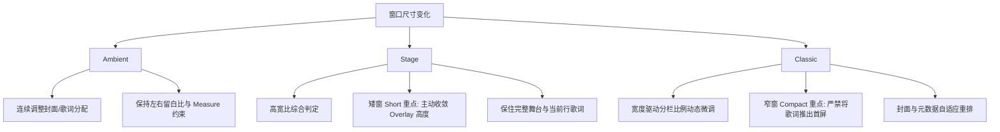

# Spotify Lyrics V3 Ambient / Stage / Classic 三模式构图设计规范

> **状态**：ACTIVE / SPECIFICATION CONTRACT  
> **制定日期**：2026-09-03  
> **权威基线**：`225edf306c30153c976f4e9474d72a0d6ed390b2`  
> **前序依赖**：  
> - `docs/superpowers/specs/2026-09-03-ui-visual-baseline-design.md` (Visual Baseline PASS)  
> - `docs/superpowers/plans/2026-09-03-ui-visual-baseline-implementation.md` (Implementation Plan PASS)  
> - Commit `225edf3` (`V3BounceButtonStyle` Pressed-State Correction PASS)  
> - Grok 三模式只读盘点结论 (`DESIGN_AUDIT_STATUS=PASS`)  
> **实施边界**：本文件为纯设计合同（Docs-only Design Contract），不修改任何 Swift 代码，不制定 implementation plan，不开始任何代码实现。

---

## 1. Global Contract（全局通用合同）

### 1.1 核心原则

1. **共享视觉基线**：Ambient、Stage、Classic 三种模式共同遵守 `docs/superpowers/specs/2026-09-03-ui-visual-baseline-design.md` 冻结的视觉基线，包括 Typography 层级、间距词汇（4~48pt）、4 层材质与景深模型、6 种控件交互状态，以及高对比度 / 极端封面可读性保障。
2. **歌词始终是核心阅读内容**：无论处于何种构图模式，歌词都是主交互与持续阅读的主体。封面权重可以提高，但任何模式都不得把歌词退化为完全无法辨识的次要装饰或不可交互图层。
3. **差异源于“构图关系”而非“更换主题”**：三种模式的本质差异在于 **专辑封面与歌词在视口中的几何关系、空间占比与环境延伸逻辑**，而不是切换独立的设计系统、换肤或变更控件风格。
4. **连续响应几何优先**：视口尺寸变化时，窗口几何优先遵循既有的连续线性插值（以 `adaptiveSplitMetrics` 为基准），不为了刻意突显模式身份而引入生硬、突兀的断点跳跃。
5. **完全继承 Reduce Motion 合同**：任何模式下的封面缩放、视口滚动与浮层过渡，均严格继承 Reduce Motion 规范（无位移、无缩放/模糊形变、仅保留约 0.12s 的短 opacity 淡化）。
6. **运行时完全解耦**：三模式构图纯属 Presentation 层级的视觉排布与渲染差异，绝对不修改播放状态机、Presentation Clock、歌词行索引判定（line index）与柔和切行合同（soft transition）。

### 1.2 冻结项（Frozen Items — 严禁重新设计）

本构图设计合同严格冻结以下系统与子系统，后续实现严禁借构图之名对以下内容进行重构：

- **背景算法与参数**：`normalizedBlur`、backdrop / palette 颜色提取算法、低频环境基底合成逻辑，以及既有深沉、克制、低调的封面驱动暗色背景方向；
- **核心时钟与数据流**：`Presentation Clock` 节拍、`line index` 计算与分发机制；
- **切行过渡合同**：自然推进的 `.softBoundary` 柔和切行动效与 seek / 切歌的 `.immediate` 瞬跳合同；
- **导航与外围架构**：Toolbar IA（工具栏布局与感知区逻辑）、Settings 架构、Fullscreen 全屏模式几何、Floating 悬浮窗几何；
- **未来与外部系统**：Stage B、Provider 接入层与底层音频播放控制。

---

## 2. Ambient — Environment Companion（环境陪伴模式）

### 2.1 核心身份定义

- **模式定位**：**环境陪伴模式（Environment Companion）**。
- **构图目标**：并非单纯追求将封面最大化，而是促成：
  $$\text{前景实体方封面} + \text{封面驱动的环境场} + \text{分栏歌词}$$
  三者在同一视口中熔铸为一个自然的有机整体。
- **保留要素**：
  1. 前景完整的 1:1 正方形专辑封面；
  2. 左右分栏的歌词持续阅读列；
  3. 曲目元数据（Track Metadata）与播放控制（Transport Controls）在空间和视觉上依附于前景封面；
  4. 视口背景环境色 100% 由当前专辑封面动态低频采样驱动；
  5. 遵循 `adaptiveSplitMetrics` 的平滑连续分栏响应；
  6. 紧凑窗口下的歌词聚焦模式（Lyrics Focus）为显式功能，不得自动无感知偷切。

### 2.2 当前问题与设计收敛要求

- **现存问题（Relevant Gap）**：  
  当前前端 `ArtworkView` 存在“孤立感”，视觉上容易呈现为一个带有独立圆角阴影的物理方块生硬地贴在同源模糊背景壁纸上，前后景缺乏场域交融。
- **设计收敛要求**：
  1. **实体感与交融感并存**：前景封面必须清晰辨识为实体唱片/专辑封面，但绝不能像与其他元素割裂的独立 Dashboard 卡片；
  2. **环境场作为视觉延伸**：背景环境场应当感知为封面色温与光感在空间中的自然外溢扩散，而非“第二张互相独立的模糊壁纸”；
  3. **严禁破坏性手段**：
     - **禁止** 修改现有 backdrop / palette / blur 核心算法；
     - **禁止** 为封面额外添加花哨的彩色发光外边框（glow / halo）；
     - **禁止** 新增带有显式背景底板的大型卡片容器（card container）。
  4. **约束边界**：合同仅锁定上述视觉关系与体验要求，不预先规定具体的 shadow radius、border opacity、渐变 mask 或 scale 数值，具体参数留由后续 implementation plan 进行针对性校准。

### 2.3 验收目标（Acceptance Targets）

| 视口规格 | 构图与视觉验收标准 |
|---|---|
| **Standard (常规)** | • 第一眼能清晰辨识前景完整的专辑方封面； • 第一眼能明显感知整个环境背景的色温与基调直接来源于该封面； • 封面与环境场属于同一个空间场域，无生硬“贴片”感； • 歌词列保持最优对比度与可读行宽，天然比封面更适合作为长时沉浸阅读焦点。 |
| **Wide (宽屏)** | • 封面保持合理尺度上限，不会因横向空间扩展而被拉伸或孤立在角落； • 歌词保持最大可读宽度约束（Measure），中留白与分栏留白比例协调。 |
| **Compact (紧凑)** | • 封面按比例平滑自适应收敛，严禁为了强保大封面尺寸而严重压缩歌词列导致频繁折行或信息截断。 |

---

## 3. Stage — Full-Window Artwork Stage（整窗舞台模式）

### 3.1 核心身份定义

- **模式定位**：**整窗舞台模式（Full-Window Artwork Stage）**。
- **构图目标**：以单张完整高清专辑封面（Single Master HD Artwork）作为整窗主舞台，界面整体呈现为舞台演播厅，而非“大图 + 侧边歌词 UI”。
- **保留要素**：
  1. 单张主封面作为背景与主体的统一来源；
  2. 严格维持 `aspect-fit` 比例，严禁裁切、拉伸或变形主封面；
  3. **绝不叠加第二张前景小封面**（取消左侧/侧边实体方块）；
  4. 歌词与播放控制（HUD）统合为舞台上方的半透浮层（Overlay），而非独立的侧边分栏；
  5. 维持底层背景渲染与采样算法不变。

### 3.2 当前问题与设计收敛要求

- **现存问题（Relevant Gap）**：
  1. **底部覆盖过大**：当前底部 overlay（双 veil 渐变 + 歌词流 + HUD）纵向占据窗口下半部分达 50%~80%，将主封面下半部分完全遮蔽；
  2. **视觉重心下沉**：视觉重心严重偏离中央，舞台感被巨大的暗色渐变块割裂；
  3. **矮窗（Short Window）严重恶化**：在高度受限的窗口中，由于固定保留大比例歌词区，导致主封面几乎被整体吞噬；
  4. **文案脱节**：设置面板现行描述（“以单张专辑封面构成全景舞台，左下融入控制，右侧悬浮歌词”）与当前实际渲染（底部居中 HUD + 全宽歌词）严重不符。

### 3.3 构图合同细则

#### (1) 主 Artwork 绝对优先级
- 主封面是舞台的绝对视觉主体，所有文字与控件均为舞台之上的服务层；
- 允许底部浮层提供必要的阅读遮罩，但**绝对禁止让用户产生“主封面实际只剩上半张”的残缺感**；
- Overlay 图层面积与视觉重量不得超过主封面主体，严禁反客为主。

#### (2) 歌词区域收敛
- 当前行歌词必须保持极高对比度与清晰度；
- 歌词区域的垂直跨度必须受到约束，严禁把主封面完全压退为无辨识度的暗色底图；
- **矮窗（Short）特别合同**：视口高度降低时，歌词浮层必须主动收敛垂直显示高度与行数上下文，优先保障主封面的舞台完整性与当前焦点行（Current Line）的可读性，严禁为了机械展示多行历史歌词而压坏舞台；
- **数值边界**：本设计合同不预设固定的 overlay 占比百分比、具体高度像素值、veil 不透明度数值或内边距，交由 implementation plan 针对性推导。

#### (3) HUD 与播放控制
- 播放控制栏（Transport Controls）必须保持克制、紧凑，禁止抢夺封面视线；
- 曲目元数据、播放进度、控制按钮与歌词必须融合成一个有机的“底部舞台信息群（Bottom Stage Information Cluster）”，而非三个相互割裂、各自浮动的独立图块；
- 双层渐变罩（Double Veil：Backdrop View 内部 veil + Window View 外部 veil）的存在与收敛方式在后续 implementation 阶段进行裁决。

#### (4) Stage 设置文案声明
- 确认现有文案“左下融入控制，右侧悬浮歌词”为历史遗留描述，与现行中央对称的舞台构图脱节；
- 后续实施计划必须包含修正用户可见文案的任务，使文本描述与模式真实身份严格一致；当前设计 commit 不修改代码。

### 3.4 验收目标（Acceptance Targets）

| 视口规格 | 构图与视觉验收标准 |
|---|---|
| **Standard / Wide** | • 视觉焦点第一眼聚焦于完整高清的 Aspect-Fit 唱片封面； • 底部信息层与舞台封面融为一体，不产生“上半张封面、下半张 UI 补丁”的生硬二分感； • 歌词与 HUD 居中平衡，呈现舞台演播氛围。 |
| **Short (高度受限)** | • 底部 overlay 显著、主动地按比例收敛，不吞噬封面主体； • 舞台主体封面依然能被完整、连贯地理解； • 当前行歌词与主控制按钮稳定可见且可正常操作，焦点行不丢失。 |

---

## 4. Classic — Album-First Split Composition（经典专辑分栏模式）

### 4.1 核心身份定义

- **模式定位**：**放大专辑 / 专辑优先分栏模式（Album-First Split Composition）**。
- **构图目标**：强化实体唱片专辑的存在感，赋予封面最大的展示权重，同时提供平行的专业歌词阅读分栏。
- **与 Ambient 的本质区别**：Classic 绝非 Ambient 的“大封面尺寸滑块版”，其差异体现在：
  1. 背景采用局部放大、高裁切（Cropped Substrate）的动态底图方案，而非 Ambient 的低频外溢光场；
  2. 前景封面具有绝对的优先排版权与专属分栏区域；
  3. 歌词列与封面列形成结构分明的双栏对照关系，而非围绕光场的向心环抱。
- **保留要素**：
  1. 更大尺寸上限的前景专辑封面；
  2. 专辑优先（Album-First）的视觉权重视重；
  3. 背景原有的局部放大截取与高斯扩散处理方向；
  4. 独立的平行歌词阅读列；
  5. 优先沿用现行分栏比例计算模型，不强行改成 Stage 类型的底部 overlay。

### 4.2 当前问题与设计收敛要求

- **现存问题（Relevant Gap）**：
  1. **面板割裂感（Panel Splitting）**：中间垂直分割线（`Divider`）过强，强化了“左侧封面卡片 / 右侧歌词卡片”两块独立 Dashboard 的生硬拼接感；
  2. **Compact 体验断崖**：在紧凑视口下，现行实现切为垂直 `ScrollView`，由于专辑封面垂直高度占比过大（`trackHeight = max(420, height * 0.76)`），导致当前歌词被完全顶出首屏，用户必须主动向下滚动才能看到歌词。

### 4.3 构图合同细则

#### (1) 分栏与画布完整性
- Classic 维持明确的双栏排版，但两栏必须感知为**同一块有机艺术画布上的两个协调区域**，而非并排拼合的两个控制面板；
- **分割线（Divider）职责**：分割线（若存在）只能充当极度克制、退居幕后的微妙留白界定，绝不得成为吸引视觉注意力的结构中心，更不能粗暴截断整窗画布的连续感；
- **冻结约定**：本设计合同不预先决定 Divider 的物理去留（保留、彻底删除、调整为微渐变或半透明），具体方案留给后续实现决定。

#### (2) Compact 窗口歌词首屏可见性合同
- **绝对冻结条款**：Compact 视口下即便遵循“专辑优先”，也**绝对禁止将用户首屏推入“仅见封面、不见当前歌词”的盲盒状态**；
- 用户打开或缩至 Compact 视口时，当前播放的焦点歌词行**必须在首屏保持立即可达、可见或位于同一个首屏阅读视距内**；
- 允许通过按比例缩减 Compact 封面尺寸、重排曲目元数据、压缩上下内边距或采用紧凑并置排布等手段实现，但本合同不预设唯一实现方案。

### 4.4 验收目标（Acceptance Targets）

| 视口规格 | 构图与视觉验收标准 |
|---|---|
| **Standard (常规)** | • 第一眼明确传递出“大专辑封面为主导 + 平行歌词阅读”的经典分栏构图； • 与 Ambient 呈现出截然不同的背景质感与封面分量，与 Stage 呈现截然不同的分栏结构； • 中间视觉过渡自然，Divider 不主导视线，封面与元数据形成稳固的 Album Block。 |
| **Wide (宽屏)** | • 大封面获得充分的展示舞台，气势恢宏； • 左右空间扩展时不形成两侧互不相关的孤立卡片； • 歌词列遵守最大可读行宽限制，排版稳健。 |
| **Compact (紧凑)** | • 专辑优先的身份依然鲜明； • **当前歌词行绝不被挤出首屏**； • 用户无需手动纵向滚动即可同时感知当前播放曲目与正在唱响的歌词。 |

---

## 5. Cross-Mode Identity Matrix（跨模式身份对照矩阵）

为防止未来演进过程中各模式界限模糊或相互同质化，确立以下三模式不可逾越的排他性身份对照矩阵：

| 构图维度 | Ambient（环境陪伴） | Stage（整窗舞台） | Classic（经典大专辑） |
|---|---|---|---|
| **首要视觉角色** *(Primary Role)* | **环境光场与陪伴** 光色交融的环境场域 | **沉浸式演播大舞台** 以整幅艺术作为剧场中心 | **实体唱片第一** 以完整大黑胶/CD 为主角 |
| **封面呈现形态** *(Artwork Form)* | 前景完整方封面（1:1） + 背景外溢低频场 | 单张完整 HD Artwork （Aspect-Fit 全画幅居中） | 独立大尺寸前景封面 + 背景局部放大裁切 |
| **前景小封面** *(Foreground Cover)* | **有**（与歌词左右并列） | **无**（严禁叠两张封面） | **有**（具有更大占比上限） |
| **歌词空间关系** *(Lyrics Relationship)* | 侧边独立分栏 （持续长时阅读列） | 舞台下半部半透 Overlay （紧凑悬浮信息流） | 侧边平行独立分栏 （结构分明的对照阅读） |
| **元数据与控制** *(Metadata & Transport)* | 空间依附于前景小封面下方 | 作为舞台底部 HUD 统一群组 | 紧密统合于 Album Block 内部 |
| **核心视觉风险** *(Main Risk)* | 封面像独立贴片贴在壁纸上 | Overlay 过大吞噬下半张封面 | 左右分栏生硬，割裂成两块卡片 |
| **Compact 应对准则** *(Compact Priority)* | 优先保障歌词阅读列完整性 | 主动收敛 Overlay 纵向高度 | **严禁将当前歌词推离首屏** |

---

## 6. Responsive Contract（响应式几何构图合同）

### 6.1 总体规则

1. **延续既有几何体系**：严格基于现有的 `compact`、`regular`、`wide` 判定与连续插值体系，不发明多余的离散断点；
2. **纯构图自适应调整**：尺寸变化主要驱动布局比例、内容间距、留白分配与信息密度收敛，不无端切换为截然不同的 UI 模式。

### 6.2 三模式响应式构图侧重

- **Ambient 响应要求**：  
  随窗口宽度变化平滑调整封面宽度分配与歌词栏宽度，维持居中平衡；在极端 Wide 窗下锁死歌词最大可读宽度并让侧边留白吸收余量。
- **Stage 响应要求（高度敏感）**：  
  高度（Height）是 Stage 模式最敏感的维度。当高度进入 Short 区间时，**必须显著收缩 Overlay 垂直占用，严禁使用固定大高度**；优先保住 aspect-fit 舞台封面的完整性和当前播放行歌词与主操作按钮。
- **Classic 响应要求（宽度敏感）**：  
  宽度驱动左右分栏配比。在 Compact 窄窗下，构图重点在于防止纵向堆叠导致歌词滑出首屏，必须在首屏内统筹好大封面与歌词首行的并存关系。

---

## 7. Explicit Non-Goals（非目标清单）

为确保后续实施高度聚焦于构图关系，明确本设计合同**绝对不涉及、不解决**以下内容：

1. **背景生成算法**：不重写 `AppleMusicImmersiveV3BackdropView` 的着色器、色彩提取与高斯模糊管线；
2. **封面提供者与画质源**：不修改 Spotify / 本地专辑封面的解析与图片下载策略；
3. **播放时钟与状态**：不改动 `Presentation Clock`、5Hz 定时器或底层音频播放管线；
4. **切行与动画参数**：不修改自然切行的 `0.30s / 0.34s` 节奏与 seek 的立即跳转合同；
5. **歌词排版系统重构**：不重新定义歌词文字的字体系列、大小与字重基线；
6. **工具栏与通用弹窗**：不重构 Toolbar 布局交互、不修改对齐详情弹窗与右键操作菜单；
7. **浮动窗与全屏模式**：不修改 Floating 窗口与 Fullscreen 全屏界面的既有构图；
8. **未来功能与 Stage B**：不讨论卡拉 OK 逐字音节、不开启任何 Stage B 特性；
9. **模式存废讨论**：不讨论“是否应将三种模式精简合并”等投机性假设。三种模式的存续已作为既定事实冻结。

---

## 8. Implementation Mapping（实现映射矩阵）

将当前代码实现与本设计合同建立明确映射，指导未来 implementation plan 的制定：

| 模块 / 现有代码 | 当前实现状态 | 合同映射分类 | 未来实施重点与说明 |
|---|---|---|---|
| **Ambient: `adaptiveSplitMetrics`** | 现有连续线性插值已实现基础分栏 | **Already aligned / preserve** | 完整保留平滑插值逻辑，作为构图自适应基石。 |
| **Ambient: 前景 `ArtworkView` 贴片感** | 实体方块漂浮于同色模糊底图上 | **Relevant design gap** | **Future implementation decision**：在不改 blur、不加彩色光晕、不加底板卡片的前提下，通过微调边缘层级与场域过渡弱化贴片感。 |
| **Ambient: 显式 `lyricsFocus`** | 需用户主动或特定设置触发 | **Already aligned / preserve** | 维持现状，不自动无感知偷切。 |
| **Stage: `stageArtworkRect`** | Aspect-Fit 居中高清单图 | **Already aligned / preserve** | 严格维持 aspect-fit 与完整未裁切特性。 |
| **Stage: 底部 Overlay 遮挡过重** | 双 veil + 歌词 + HUD 遮蔽下半部 50%+ | **Relevant design gap** | **Future implementation decision**：收敛 Overlay 纵向跨度，消除“下半截被吞噬”的二分割裂感。 |
| **Stage: 矮窗（Short Window）恶化** | 固定大比例导致主封面几乎被淹没 | **Relevant design gap** | **Future implementation decision**：确立矮窗下 overlay 弹性收缩机制，保住舞台与当前行。 |
| **Stage: 设置文案脱节** | 文案提及“左下控制、右侧悬浮歌词” | **Relevant design gap** | **Future implementation decision**：在后续代码任务中修正文案，使之与底部居中真实渲染一致。 |
| **Classic: 大封面与高比重** | 支持更大尺寸上限的前景封面 | **Already aligned / preserve** | 维持其 Album-first 的核心比重优势。 |
| **Classic: 纵向分割线 `Divider`** | `Divider().overlay(...)` 带来面板感 | **Relevant design gap** | **Future implementation decision**：使分割线极大程度弱化或融入背景留白，消除两块独立面板的割裂感。 |
| **Classic: Compact 歌词推离首屏** | 垂直 ScrollView 导致封面占满首屏 | **Relevant design gap** | **Future implementation decision**：重组 Compact 构图，确保当前播放行歌词首屏立即可达。 |
| **通用: Backdrop / Blur 算法** | 现有多层材质与色彩提取 | **Out of scope** | 严格冻结，严禁借构图之名重写背景管线。 |
| **通用: Presentation Clock / 播放** | 核心播放与切行时钟 | **Out of scope** | 严格冻结，无运行时介入。 |

---

## 9. Acceptance Contract（设计验收清单）

本设计合同生效与验收必须逐项通过以下 13 项硬性检查：

- [x] **1. 三模式身份清晰排他**：Ambient（环境陪伴）、Stage（整窗舞台）、Classic（大专辑分栏）三者定义清晰，杜绝相互同质化；
- [x] **2. Ambient 视觉交融目标确立**：明确解决“前景封面与环境场的视觉交融”，明令禁止修改背景算法、添加彩色光晕或大型卡片底板；
- [x] **3. Stage 舞台主体地位明确**：确立单张 Aspect-Fit HD Artwork 为唯一舞台主体，严禁底部 Overlay 反客为主吞噬封面；
- [x] **4. Stage 矮窗（Short）收敛合同**：针对矮窗确立了弹性收缩 Overlay、保住舞台主体与当前播放行的硬性准则；
- [x] **5. Classic 专辑优先构图确立**：明确其 Album-first 实体唱片特性，严禁降级为 Ambient 放大版或 Stage 悬浮版；
- [x] **6. Classic Compact 首屏歌词可见性**：冻结硬性底线，严禁在 Compact 窗口下将当前歌词推出首屏；
- [x] **7. 分割线（Divider）职责界定**：仅定义其克制、不割裂画布的视觉职责，不提前预判去留或硬编码样式；
- [x] **8. 响应式系统延续既有机制**：完全依赖现有几何插值体系，不重新发明断点；
- [x] **9. 背景底层算法完全冻结**：严格封存 backdrop、palette 提取与 blur 渲染管线；
- [x] **10. 运行时时钟与切行动效完全隔离**：不触及 Presentation Clock、line index 与 soft transition；
- [x] **11. 外围系统完全隔离**：不借机进行 Toolbar IA 或 Settings 架构的提前重构；
- [x] **12. 严格 Docs-Only**：本任务仅建立设计规范合同，未编写 implementation plan；
- [x] **13. 代码零修改**：未修改任何 Swift 代码与项目文件。

---

## 10. 结论

`V3_COMPOSITION_DESIGN_STATUS=PASS`

本设计合同完整建立了 Spotify Lyrics V3 Ambient、Stage、Classic 三模式的视觉构图规范、边界约束、跨模式矩阵与实现映射，具备充分的可验收性与工程指导价值。
