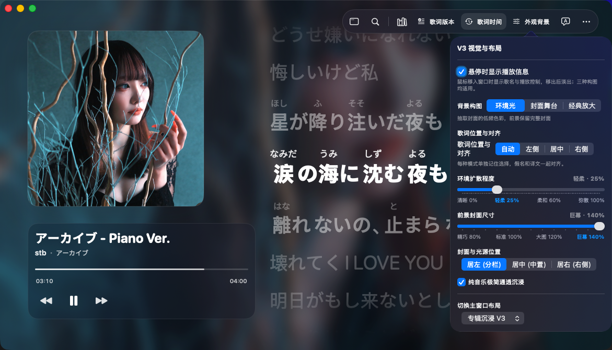
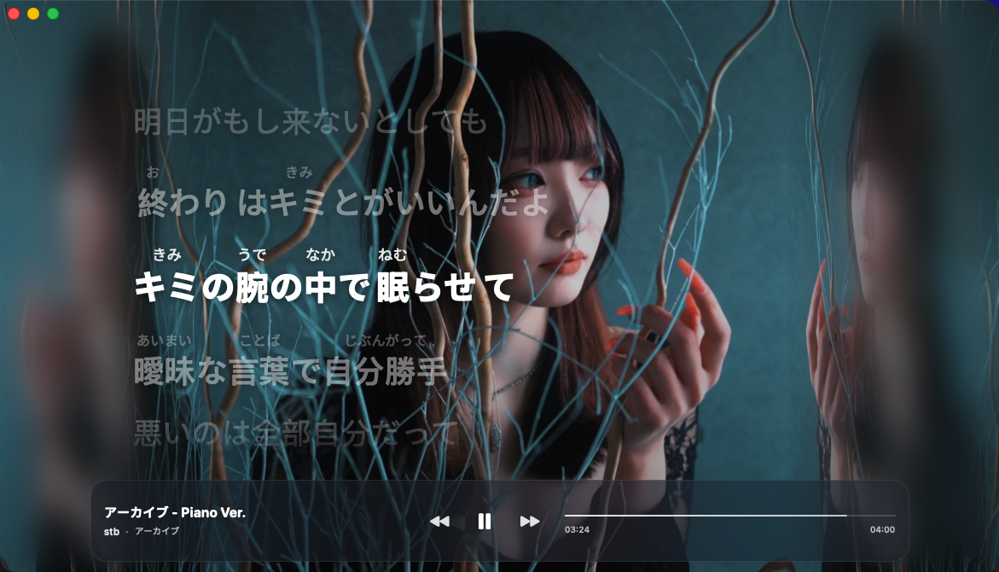
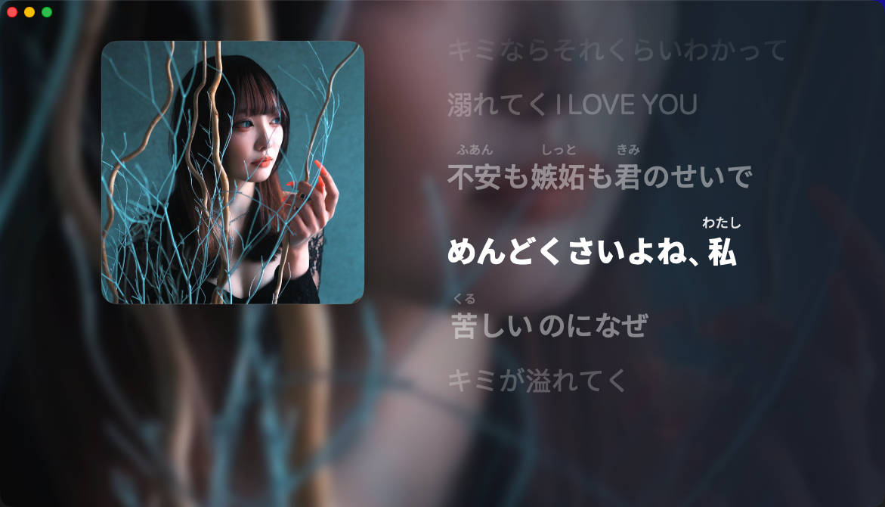
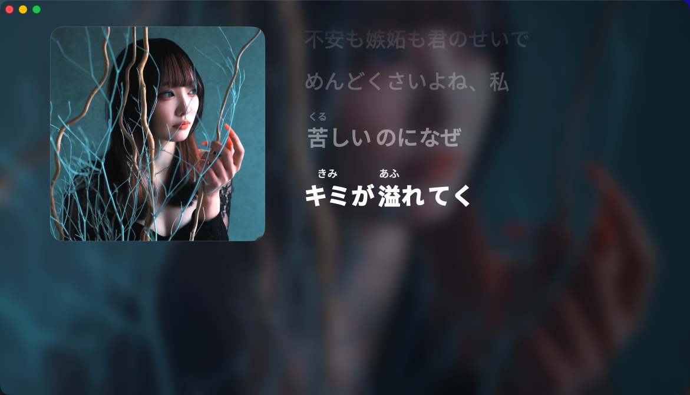
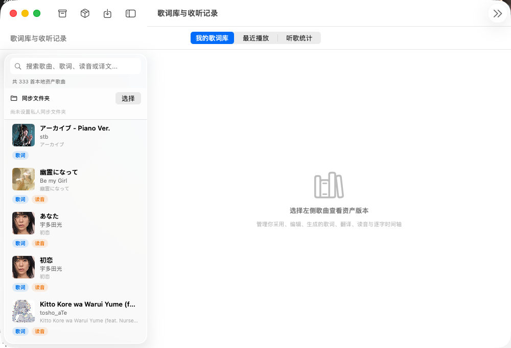
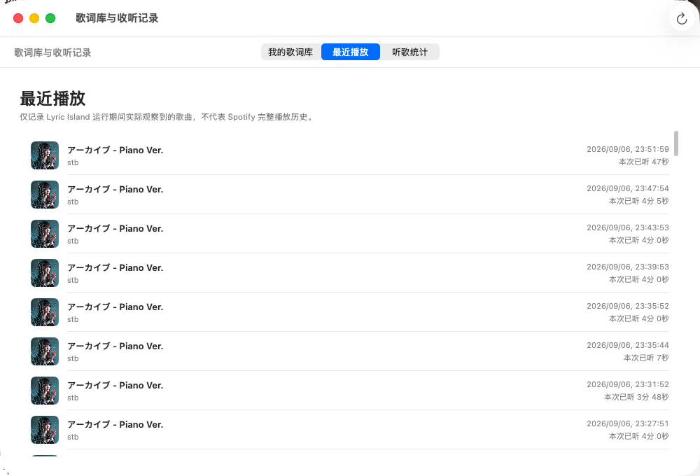
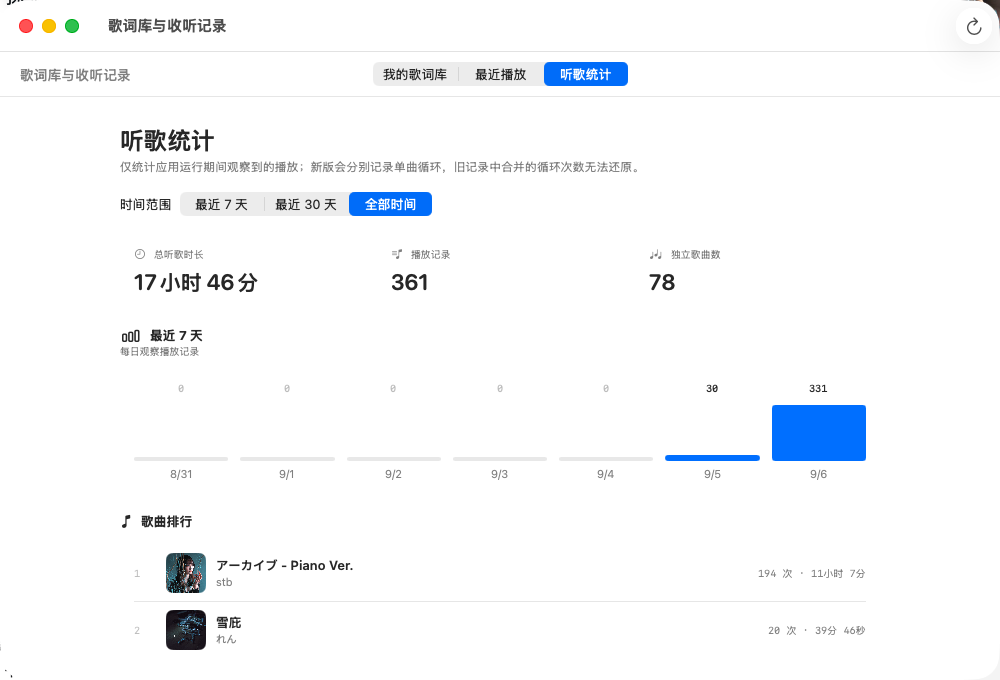

# Experience feedback — 2026-09-06

User-authorized work follows the supplied preview screenshots: reading controls, unified navigation, observed repeat counts, ambient/floating clarity, capsule responsiveness, history/statistics covers.

## Changes and causes

- V3 toolbar now has one library/activity button, preserving the last selected tab. A direct lyrics-display popover exposes kana, romaji, translation and kana arrangement through the existing shared preferences.
- ListeningHistorySession previously ignored position and kept all same-track repeats in one UUID. It now emits a completed entry at a sampled end-to-start boundary and starts a new UUID, splitting elapsed listening time without loss/double-counting. Explicit in-app seeks invalidate boundary detection; paused seeks, ordinary backward seeks and long observation gaps do not invent repeats. End-to-start moves in an external player indistinguishable from natural replay may be classified as a new observed play. Counts remain local observed sessions, not Spotify lifetime play counts. No historical counts were synthesized.
- Covers were hardcoded placeholders. History and Top Songs now use the existing image cache and stored track identity-family artwork. New sessions fill missing track artwork without a schema change; later same-song metadata can enrich the current session. History merge preserves DB artwork if memory lacks it. Old tracks without saved artwork retain a neutral placeholder until artwork is observed.
- Ambient derivative raised from 48 to 384 pixels and diffusion reduced from 66 to 24 max points; distant lyric blur reduced. Complete stage cover and freely resizable windows unchanged.
- Transparent desktop window no longer has an AppKit shadow or hover border. Toolbar uses a flat translucent fill instead of live material. Five chained text shadows replaced with one tight shadow, removing compounding halos. Explicit material surface option retained.
- Capsule hover dwell reduced from 450 to 140ms, exit debounce 350 to 220ms. Geometry uses a damped spring with immediate content fade; fixed top anchor, hit testing, menu/seek guards and Reduce Motion retained.

## Evidence

- New repeat regression failed on old implementation, then passed. Six complete repeats plus current playback produce seven persisted records and exactly 1081 seconds. Tests cover pause/gap/backward/explicit seek, cover reload and late nil→URL→nil enrichment, DB lock failure/retry.
- PASS: `bash Tests/listening_history_contract.sh`, `bash Tests/listening_statistics_contract.sh`, `bash Tests/library_revisions_contract.sh`.
- PASS: `bash Tests/v3_lyric_readability_contract.sh`, `bash Tests/v3_ambient_backdrop_contract.sh`, `bash Tests/v3_backdrop_contract.sh`, `bash Tests/capsule_lyrics_contract.sh`, `bash Tests/capsule_v4_reference_motion_contract.sh`, `bash Tests/capsule_v4_top_attached_contract.sh`, `bash Tests/capsule_v4_shape_contract.sh`, `bash Tests/capsule_window_behavior_contract.sh`, `bash Tests/floating_lyrics_contract.sh`, `bash Tests/floating_window_behavior_contract.sh`.
- Existing source-policy assertions for 48px derivative and motion constants were updated to reflect this explicit new user direction; these are structural checks, not proof of animation quality.
- Debug and Release builds passed with `xcodebuild -project SpotifyLyrics.xcodeproj -scheme SpotifyLyrics -configuration <Debug|Release> -derivedDataPath <path> CODE_SIGNING_ALLOWED=NO build`. Debug path `/tmp/lyrics-experience-integration-deriveddata`; Release `/tmp/lyrics-experience-delivery-release`.
- Independent reviewer found a late-artwork gap; fixed with regression coverage, then re-reviewed without remaining blockers.
- Native Release launched, loaded live Spotify, unified library/history/statistics navigated. Screenshots confirmed actual artwork in both history and Top Songs and preserved historical statistics (43 observations across approximately two hours at check time). No synthetic user data or deliberate test seeks/switches were performed.
- Dynamic Lyrics reference app was opened and its main UI read. Its capsule motion was not measured. CUA could not reliably reveal the auto-hidden toolbar, so direct popover interaction and dynamic floating/capsule visual acceptance remain unverified. Static screenshots cannot prove the user's live compositing complaint resolved. Do not claim parity with Dynamic Lyrics or full runtime visual acceptance.

## GitHub screenshot evidence

### V3 主窗口预览

### 歌词库、最近播放与听歌统计

### 为什么截图里主要是这一首歌

截图里反复出现《アーカイブ - Piano Ver.》，原因是这次验收期间一直在循环播放它，不是应用只能识别或只保存这一首歌。

- “我的歌词库”截图仍然列出了其它歌曲，说明歌曲和歌词版本并未被过滤成单曲。
- “最近播放”里同一首歌出现多条不同时间的记录，是因为每次从接近结尾回到开头都会被本地识别为一次新的观测播放。
- “听歌统计”按本地观测到的播放记录聚合，因此持续循环的歌曲自然会占据当前统计窗口的首位。

这些数字是 lyricsQ 自己观察到的播放会话，不代表 Spotify 的完整历史播放次数；截图也没有合成其它歌曲的播放数据。

## Delivery

Preview: `/Users/apple/Downloads/LyricsQ-experience-feedback-20260906/SpotifyLyrics-experience-feedback.app`.
Formal dirty root `/Users/apple/backup/sptifylyrics` untouched. Work is on `codex/lyrics-search-ambient-fix`, isolated worktree `/private/tmp/spotifylyrics-experience-restoration-20260905`, not merged to main. BUILD_INFO and evidence accompany preview; user visual acceptance pending.
